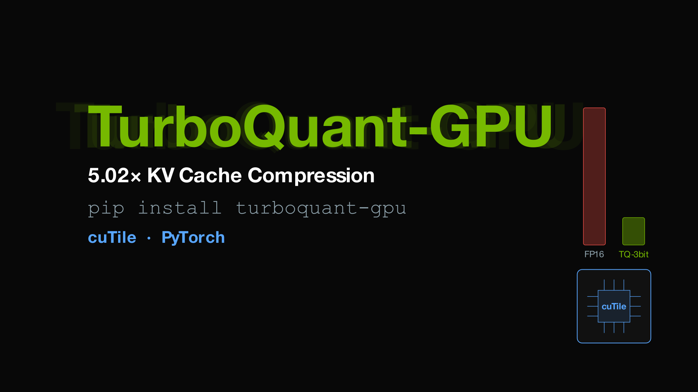
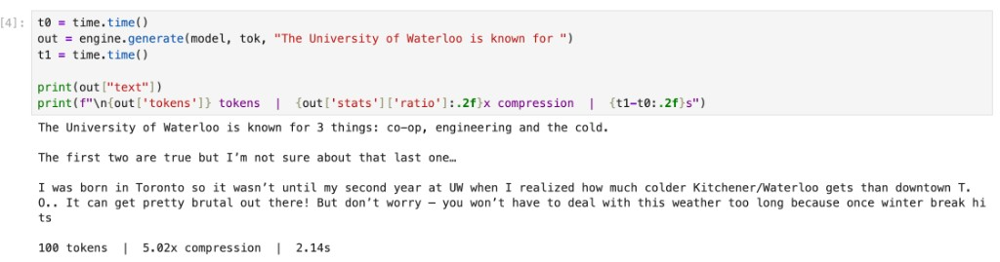
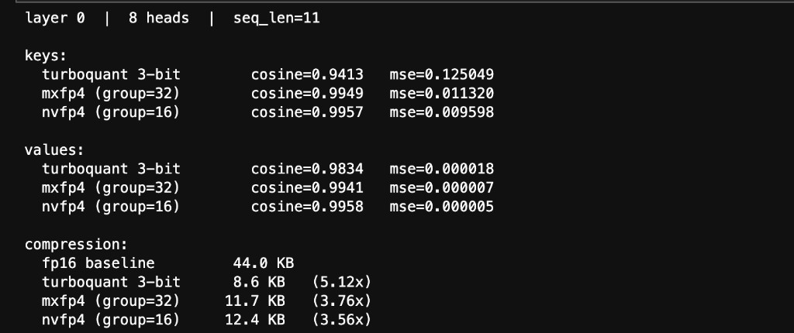

# TurboQuant-GPU



**5.02x KV cache compression for LLM inference.** Works on any NVIDIA GPU. cuTile kernels with automatic PyTorch fallback.

```
pip install turboquant-gpu
```

Based on [TurboQuant](https://arxiv.org/abs/2501.09747) (ICLR 2026).

## quickstart

```python
from transformers import AutoModelForCausalLM, AutoTokenizer
from turboquant_gpu import TurboQuantEngine
import torch

model_id = "mistralai/Mistral-7B-v0.1"
model = AutoModelForCausalLM.from_pretrained(model_id, torch_dtype=torch.float16, device_map="cuda")
tok   = AutoTokenizer.from_pretrained(model_id)

engine = TurboQuantEngine(head_dim=128, total_bits=3, device="cuda")
result = engine.generate(model, tok, "The University of Waterloo is known for ")

print(result["text"])
print(f"{result['tokens']} tokens | {result['stats']['ratio']:.2f}x compression")
```



## how it works

Random orthogonal rotation makes each KV cache coordinate approximately Gaussian. Lloyd-Max quantization is then optimal for that distribution, giving 3 bits per element with 0.98 cosine similarity.

Keys get 2-bit MSE quantization + 1-bit QJL bias correction. Values get 3-bit MSE quantization. Both are compressed in a single fused kernel launch per attention head.

## vs NVIDIA FP4



TurboQuant achieves 5.02x compression compared to 3.76x (MXFP4) and 3.56x (NVFP4) because it exploits the post-rotation Gaussian structure specific to KV caches, rather than using a general-purpose FP4 format.

## install

```bash
pip install turboquant-gpu
```

For cuTile GPU kernel acceleration (optional, requires CUDA 13.0+ driver):
```bash
pip install cuda-tile[tileiras] --extra-index-url https://pypi.nvidia.com
```

If cuda-tile isn't available or your driver is older, everything still works via PyTorch.

## API

```python
engine = TurboQuantEngine(head_dim=128, total_bits=3, device="cuda")

# one-call generation
result = engine.generate(model, tokenizer, "your prompt")

# step-by-step
compressed = engine.compress_kv_cache(out.past_key_values)
cache      = engine.build_cache(compressed)
stats      = engine.compression_stats(out.past_key_values)

# auto-tune for your GPU (benchmarks cutile vs pytorch, 2-bit vs 3-bit)
engine.auto_tune(seq_len=512)
```

## GPU support

Uses [cuTile](https://docs.nvidia.com/cuda/cutile-python/) for cross-architecture kernel portability. Falls back to PyTorch automatically.

| GPU | cuTile kernels | PyTorch fallback |
|-----|---------------|-----------------|
| A100 (sm_80) | CUDA 13.2+ | always works |
| H100 (sm_90) | not yet (tileiras) | always works |
| RTX 4090 (sm_89) | CUDA 13.2+ | always works |
| B200 (sm_100) | CUDA 13.0+ | always works |
| Any other CUDA GPU | depends on tileiras | always works |

## kernels

| kernel | what it does |
|--------|-------------|
| `compress_kv_3bit` | fused K+V compression in one launch |
| `compress_keys` | key-only: normalize, rotate, Lloyd-Max, QJL |
| `compress_values` | value-only: normalize, rotate, Lloyd-Max |
| `decompress_values` | dequantize, un-rotate, rescale |
| `fused_attention` | scores + online softmax + V accumulation |

## notebooks

| notebook | what it does |
|----------|-------------|
| [quickstart.ipynb](quickstart.ipynb) | install, load model, generate, auto-tune |
| [kernel_analysis.ipynb](kernel_analysis.ipynb) | Nsight profiling, NVTX markers, quality comparison vs MXFP4/NVFP4 |

## license

MIT
